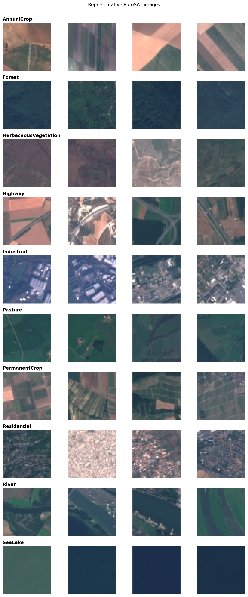

# Calibrated EuroSAT: From Statistical Features to Calibrated Deep Learning

## Abstract

This study evaluates how representation learning and post-hoc calibration change land-cover classification on the 27,000-image EuroSAT RGB dataset. Three classifiers were compared on one fixed stratified 70/15/15 split: multinomial logistic regression using nine handcrafted image statistics, logistic regression using frozen ImageNet-pretrained ResNet18 embeddings, and a fine-tuned ResNet18. Every configuration decision used training and validation data; each selected classifier was frozen before test evaluation. Fine-tuned ResNet18 achieved 97.95% test accuracy and 97.85% macro-F1, compared with 94.94% and 94.71% for the frozen representation. Paired bootstrap intervals and an exact McNemar test support the improvement on the fixed test images. Validation-only temperature scaling reduced test log loss from 0.0741 to 0.0601 and 15-bin expected calibration error from 0.0122 to 0.0028 without changing any predicted class. These results measure performance on held-out EuroSAT images under an image-level split. Because geographic grouping metadata was unavailable, they do not demonstrate generalization to unseen regions.

## 1. Research objective

The project asks how increasingly spatial and task-specific representations affect both classification and probability quality on EuroSAT RGB. It follows a controlled progression:

1. interpretable global colour and texture statistics with multinomial logistic regression;
2. a frozen ImageNet-pretrained ResNet18 used as a 512-dimensional feature extractor;
3. task-specific fine-tuning of ResNet18;
4. validation-only temperature scaling of the selected neural checkpoint.

Accuracy and macro-F1 describe classification quality. Multiclass log loss, multiclass Brier score, and top-label expected calibration error (ECE) assess the probability estimates. The objective is comparative: every model uses the same observations and fixed split so that improvements can be paired at image level.

## 2. Dataset and audit

The study uses the RGB release of [EuroSAT](https://doi.org/10.5281/zenodo.7711097), which contains 27,000 Sentinel-2 image patches from 10 land-cover classes. Each observation is a 64 × 64 RGB image. Class sizes range from 2,000 to 3,000 images, giving a modest maximum-to-minimum imbalance ratio of 1.5:1. Macro-F1 is therefore reported with accuracy rather than introducing weighted loss or oversampling without validation evidence.

The audit found no missing or non-finite handcrafted features and no exact file duplicates by MD5. It did not test for near-duplicate or geographically related patches. The saved stratified split uses seed 42 and is never regenerated:

| Partition | Images | Fraction |
|---|---:|---:|
| Training | 18,900 | 70% |
| Validation | 4,050 | 15% |
| Test | 4,050 | 15% |

The split checksum is `f97c4ec9a27435a932662d5a8b707255`. Numeric indices and portable manifests are committed under [`data/splits/`](data/splits/).

## 3. Experimental protocol

The same fixed split is reused throughout. Training data fit model parameters; validation data select hyperparameters, checkpoints, fine-tuning policy, and the calibration temperature. The test partition is evaluated only after a stage's choices are frozen. Model comparison uses saved per-image predictions joined by `dataset_index`, which prevents row ordering from breaking the paired design.

The primary selection criterion is validation macro-F1, followed by lower validation log loss where the registered rule requires a tie-breaker. Reported outputs include accuracy, macro-F1, per-class precision and recall, log loss, Brier score, ECE, confusion matrices, and image-level predictions. ECE uses 15 top-label confidence bins and should be interpreted with its binning definition.

## 4. Statistical baseline

The first classifier uses nine global image summaries: the mean and standard deviation of each RGB channel, brightness, contrast, and grayscale entropy. A `StandardScaler` and multinomial logistic regression are fit as one pipeline. Six regularization values were compared on validation data; `C = 100` was selected by macro-F1 and the final pipeline was refit on training plus validation observations.

| Test metric | Result |
|---|---:|
| Accuracy | 0.747654 |
| Macro-F1 | 0.734614 |
| Log loss | 0.737415 |
| Multiclass Brier score | 0.360327 |
| Top-label ECE | 0.024566 |

The model establishes an interpretable benchmark, but global summaries discard geometry and local spatial context. That loss is especially restrictive for classes distinguished by roads, waterways, field structure, or building layout. Correlated input features also mean individual logistic-regression coefficients are predictive associations rather than stable causal effects.

## 5. Frozen ResNet18 representation

An ImageNet-pretrained ResNet18 with pinned `IMAGENET1K_V1` weights produces a 512-dimensional embedding for each image. The convolutional backbone remains frozen and in evaluation mode. A standardized multinomial logistic regression classifier is then trained on the embeddings. Validation comparison across six regularization values selected `C = 0.01`; the selected pipeline was refit on the combined training and validation embeddings before its locked test evaluation.

| Test metric | Result |
|---|---:|
| Accuracy | 0.949383 |
| Macro-F1 | 0.947055 |
| Log loss | 0.159799 |
| Multiclass Brier score | 0.078636 |
| Top-label ECE | 0.020928 |

Relative to the handcrafted baseline, frozen spatial features improve accuracy by 20.17 percentage points and macro-F1 by 21.24 points. PermanentCrop, River, and Highway remain the weakest classes, motivating controlled task-specific fine-tuning.

## 6. Fine-tuned ResNet18

The fine-tuning protocol is registered in [`STAGE4_PROTOCOL.md`](STAGE4_PROTOCOL.md). Both candidates begin from `IMAGENET1K_V1` and a shared three-epoch classifier-head warm-up. Candidate A then trains `layer4` and the classification head; Candidate B fine-tunes the full network. Selection uses validation macro-F1, with log loss only as a tie-breaker. Candidate A at epoch 12 achieves validation macro-F1 0.977565, slightly above Candidate B's 0.977003, and is frozen for the one-time test evaluation.

| Test metric | Frozen ResNet18 | Fine-tuned ResNet18 | Fine-tuned change |
|---|---:|---:|---:|
| Accuracy | 0.949383 | **0.979506** | +0.030123 |
| Macro-F1 | 0.947055 | **0.978540** | +0.031485 |
| Log loss | 0.159799 | **0.074072** | −0.085727 |
| Multiclass Brier score | 0.078636 | **0.033437** | −0.045199 |
| Top-label ECE | 0.020928 | **0.012213** | −0.008715 |

Lower values are better for log loss, Brier score, and ECE. The selected checkpoint SHA-256 is `3f6a701aca082fa675ba229ddfbae0139346e3cbff84ea02ff0617ab73c5d657`.

## 7. Paired model comparison

Stage 6 aligns all three models' predictions on the 4,050 test images. Each of 2,000 bootstrap replicates samples image indices with replacement and applies the same indices to both models. Intervals are 95% percentile intervals for `second − first`.

For fine-tuned minus frozen ResNet18:

| Metric | Difference | 95% paired bootstrap interval |
|---|---:|---:|
| Accuracy | +0.030123 | [0.023704, 0.036790] |
| Macro-F1 | +0.031485 | [0.024878, 0.038559] |
| Log loss | −0.085727 | [−0.102065, −0.068015] |
| Multiclass Brier score | −0.045199 | [−0.053137, −0.037320] |

Every interval excludes zero in the direction favoring the fine-tuned model. Among the 182 images for which exactly one of these models is correct, frozen ResNet18 alone is correct on 30 and fine-tuned ResNet18 alone on 152. The two-sided exact McNemar p-value is `7.70 × 10⁻²¹`. These results quantify paired differences on this fixed image-level test set; they do not correct for spatial dependence or establish performance under geographic shift.

## 8. Probability calibration

Stage 5, documented in [`STAGE5_PROTOCOL.md`](STAGE5_PROTOCOL.md), fits one positive scalar temperature to the locked Candidate A validation logits by minimizing multiclass negative log likelihood. The fitted value, `T = 1.822680`, is frozen before test metrics are calculated. Because division by a positive scalar preserves logit ordering, all predicted classes remain unchanged.

| Test metric | Before calibration | After calibration | Change |
|---|---:|---:|---:|
| Accuracy | 0.979506 | 0.979506 | 0.000000 |
| Macro-F1 | 0.978540 | 0.978540 | 0.000000 |
| Log loss | 0.074072 | **0.060098** | −0.013974 |
| Multiclass Brier score | 0.033437 | **0.031412** | −0.002026 |
| Top-label ECE | 0.012213 | **0.002788** | −0.009425 |

Paired bootstrap intervals for the changes in log loss, Brier score, and ECE exclude zero on the fixed test observations. The result is evidence of improved in-domain probability quality, not calibration under distribution or geographic shift.

## 9. Qualitative failure-case analysis

The fine-tuned classifier makes 83 errors among 4,050 test images. The highest counts occur for PermanentCrop (21 of 375), Pasture (16 of 300), HerbaceousVegetation (13 of 450), River (11 of 375), and Highway (8 of 375). Forest and SeaLake have no errors on this fixed split. Frequent directed confusion pairs include PermanentCrop → AnnualCrop (11), Pasture → AnnualCrop (7), PermanentCrop → HerbaceousVegetation (6), Pasture → Forest (5), River → Highway (5), and HerbaceousVegetation → Pasture (5).

Fine-tuning corrects 152 frozen-model errors, introduces 30 errors on images the frozen model classifies correctly, and leaves both models wrong on 53 images. The qualitative review contains 18 deliberately selected cases: six priority-class cases, six of the remaining highest-confidence fine-tuned errors, and six of the remaining highest-confidence corrections. Human notes describe visible field geometry, narrow linear features, vegetation, and built-up patterns as possible sources of ambiguity. These interpretations are hypotheses based on small RGB patches; they do not reveal a model's causal decision process or justify changing a manifest label.

## 10. Limitations

1. **No geographic holdout.** The fixed split is stratified at image level and does not incorporate acquisition location. Nearby or visually related Sentinel-2 patches may occur in different partitions.
2. **Possible spatial dependence.** Paired bootstrap resampling treats images as independent. Unmodelled dependence could make intervals too narrow.
3. **RGB-only input.** The experiment omits additional Sentinel-2 spectral bands that may help separate visually similar land-cover classes.
4. **Small spatial context.** Each 64 × 64 patch offers limited context for narrow roads, rivers, field structure, and mixed land cover.
5. **No external-domain evaluation.** Performance is measured on held-out EuroSAT images, without another region, season, sensor, or dataset.
6. **Selected qualitative cases.** The 18 reviewed examples intentionally emphasize priority classes and high-confidence outcomes; they do not estimate the prevalence of a visual failure mechanism.
7. **Metric-specific uncertainty.** ECE depends on the 15-bin definition, and the project does not adjust exploratory pairwise metrics for multiplicity.
8. **Locked test discipline.** Test results and failure cases describe the selected systems and were not used for additional model selection, relabelling, or calibration tuning.

## 11. Conclusion

The project demonstrates a coherent progression from interpretable global features to spatial transfer learning and calibrated deep learning. Handcrafted statistics provide a transparent 74.77% accuracy baseline. Frozen ImageNet features produce the largest improvement, reaching 94.94%, which shows the value of a learned spatial representation even without task-specific backbone training. Controlled partial fine-tuning adds a smaller but consistent gain to 97.95% accuracy and improves every reported probability metric. Validation-only temperature scaling then sharpens probability quality while preserving every class prediction.

The result is a reproducible in-domain EuroSAT study rather than evidence of operational geographic generalization. The strongest scientific extension would use location-aware group splits or an external geographic test set, ideally with multispectral inputs, while preserving the validation-only selection and locked-test discipline used here.

## 12. Reproducibility and artifacts

The analysis is organized as seven notebooks:

1. [`01_data_audit.ipynb`](Notebooks/01_data_audit.ipynb)
2. [`02_statistical_baseline.ipynb`](Notebooks/02_statistical_baseline.ipynb)
3. [`03_frozen_resnet18_embeddings.ipynb`](Notebooks/03_frozen_resnet18_embeddings.ipynb)
4. [`04_finetuned_resnet18.ipynb`](Notebooks/04_finetuned_resnet18.ipynb)
5. [`05_temperature_scaling.ipynb`](Notebooks/05_temperature_scaling.ipynb)
6. [`06_paired_model_comparison.ipynb`](Notebooks/06_paired_model_comparison.ipynb)
7. [`07_failure_case_analysis.ipynb`](Notebooks/07_failure_case_analysis.ipynb)

Supporting records include:

- fixed manifests and checksum: [`data/splits/`](data/splits/);
- data audit and EDA figures: [`reports/`](reports/);
- model predictions and metrics: [`results/`](results/);
- Stage 4 decision record: [`STAGE4_PROTOCOL.md`](STAGE4_PROTOCOL.md);
- Stage 5 calibration record: [`STAGE5_PROTOCOL.md`](STAGE5_PROTOCOL.md);
- project history and limitations: [`PROJECT_HANDOVER.md`](PROJECT_HANDOVER.md).

The raw dataset and trained checkpoints are intentionally excluded from Git. GPU stages record the pretrained weight enum, transforms, software versions, CUDA version, device, seeds, split checksum, and selected checkpoint hash. Environment requirements are listed in [`requirements.txt`](requirements.txt).

## References

1. P. Helber, B. Bischke, A. Dengel, and D. Borth, “EuroSAT: A Novel Dataset and Deep Learning Benchmark for Land Use and Land Cover Classification,” *IEEE Journal of Selected Topics in Applied Earth Observations and Remote Sensing*, vol. 12, no. 7, pp. 2217–2226, 2019. [doi:10.1109/JSTARS.2019.2918242](https://doi.org/10.1109/JSTARS.2019.2918242).
2. P. Helber, B. Bischke, A. Dengel, and D. Borth, “EuroSAT,” Zenodo dataset archive. [doi:10.5281/zenodo.7711097](https://doi.org/10.5281/zenodo.7711097).
3. K. He, X. Zhang, S. Ren, and J. Sun, “Deep Residual Learning for Image Recognition,” *Proceedings of the IEEE Conference on Computer Vision and Pattern Recognition*, 2016. [doi:10.1109/CVPR.2016.90](https://doi.org/10.1109/CVPR.2016.90).
4. C. Guo, G. Pleiss, Y. Sun, and K. Q. Weinberger, “On Calibration of Modern Neural Networks,” *Proceedings of the 34th International Conference on Machine Learning*, 2017. [Proceedings of Machine Learning Research](https://proceedings.mlr.press/v70/guo17a.html).
