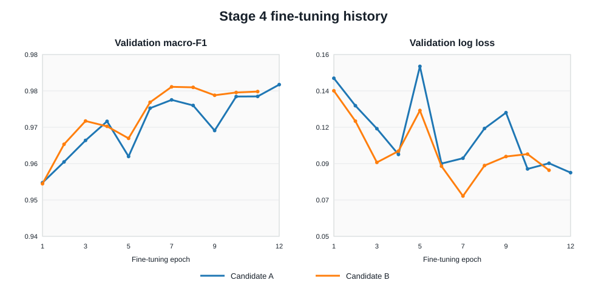
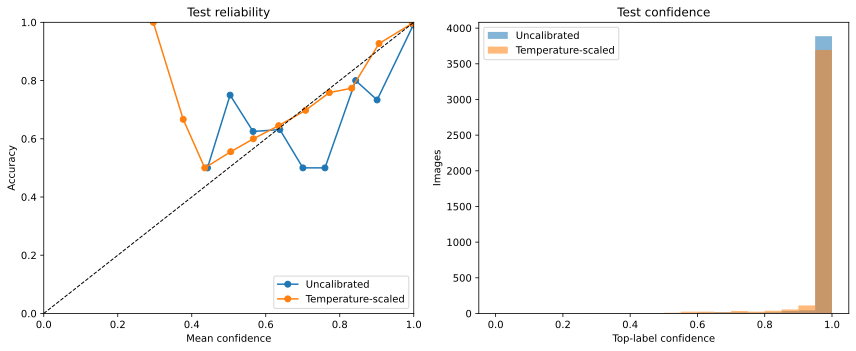
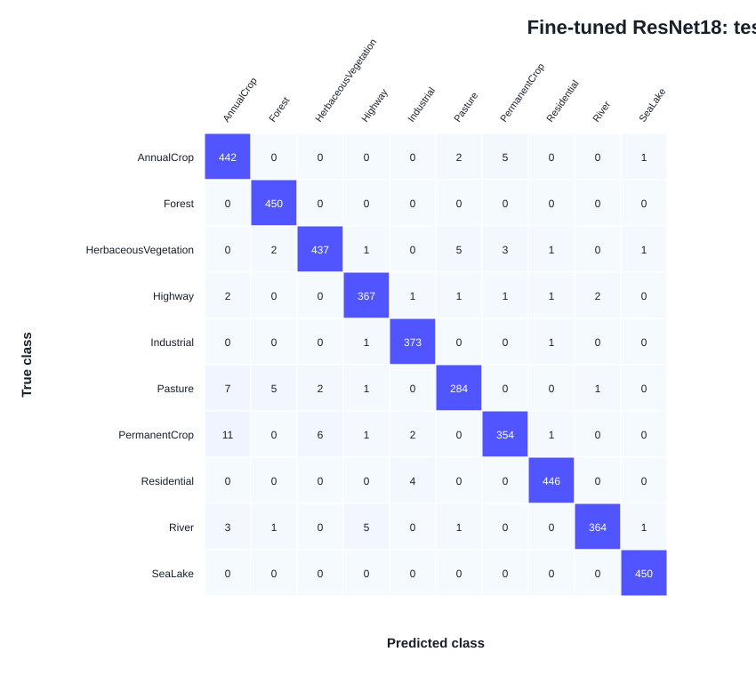
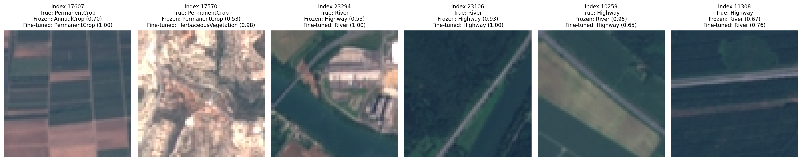

# Calibrated EuroSAT

A reproducible computer-vision study on the EuroSAT RGB land-cover dataset, connecting interpretable statistical image features with transfer learning, uncertainty analysis, and model calibration.

**Project status:** complete. Read the consolidated [final report](FINAL_REPORT.md), or use this README as the portfolio summary.

## Current results

The completed statistical baseline uses nine global colour and texture features with standardized multinomial logistic regression.

| Metric | Validation | Test |
|---|---:|---:|
| Accuracy | 0.740 | 0.748 |
| Macro-F1 | 0.727 | 0.735 |
| Log loss | 0.755 | 0.737 |
| Multiclass Brier score | 0.366 | 0.360 |
| Top-label ECE | 0.017 | 0.025 |

The strongest test classes were SeaLake, Industrial, and Forest. Highway was the weakest class, followed by PermanentCrop and River. These results establish a transparent benchmark for the subsequent CNN experiments; they are not presented as the final model.

The frozen ResNet18 stage is complete. An ImageNet-pretrained ResNet18 produced
512-dimensional embeddings, followed by a standardized linear classifier with
validation-selected `C = 0.01`.

| Metric | Validation | Test |
|---|---:|---:|
| Accuracy | 0.939 | 0.949 |
| Macro-F1 | 0.937 | 0.947 |
| Log loss | 0.183 | 0.160 |
| Multiclass Brier score | 0.091 | 0.079 |
| Top-label ECE | 0.019 | 0.021 |

Compared with the handcrafted baseline, the frozen representation improved test
accuracy by 20.2 percentage points and macro-F1 by 21.2 percentage points. The
test partition was evaluated once after the representation and classifier were
frozen.

Stage 4 fine-tuned the same ImageNet-pretrained ResNet18. After a shared
three-epoch head warm-up, validation-only selection compared partial fine-tuning
(`layer4` + classifier) with full-network fine-tuning. The partial candidate at
epoch 12 was frozen before the single test evaluation.

| Metric | Frozen ResNet18 | Fine-tuned ResNet18 | Change |
|---|---:|---:|---:|
| Accuracy | 0.949 | **0.980** | +0.030 |
| Macro-F1 | 0.947 | **0.979** | +0.031 |
| Log loss | 0.160 | **0.074** | -0.086 |
| Multiclass Brier score | 0.079 | **0.033** | -0.045 |
| Top-label ECE | 0.021 | **0.012** | -0.009 |

Lower values are better for log loss, Brier score, and ECE. The locked Stage 4
checkpoint has SHA-256
`3f6a701aca082fa675ba229ddfbae0139346e3cbff84ea02ff0617ab73c5d657`.



Stage 5 fitted one scalar temperature using validation logits from the locked
Stage 4 checkpoint. The temperature was frozen at `1.822680` before calibrated
test metrics were calculated. Classification predictions are unchanged.

| Test metric | Before calibration | After calibration | Change |
|---|---:|---:|---:|
| Accuracy | 0.979506 | 0.979506 | 0.000000 |
| Macro-F1 | 0.978540 | 0.978540 | 0.000000 |
| Log loss | 0.074072 | **0.060098** | -0.013974 |
| Multiclass Brier score | 0.033437 | **0.031412** | -0.002026 |
| Top-label ECE | 0.012213 | **0.002788** | -0.009425 |

Paired 2,000-resample bootstrap intervals for the three probability-metric
changes exclude zero. These intervals quantify uncertainty on the fixed
image-level test set and do not establish calibration under geographic shift.



## Dataset

- **Dataset:** EuroSAT RGB
- **Source:** official EuroSAT release by Helber et al.
- **DOI:** [10.5281/zenodo.7711097](https://doi.org/10.5281/zenodo.7711097)
- **Samples:** 27,000
- **Classes:** 10
- **Resolution:** 64 × 64 RGB

The raw archive and extracted images are intentionally excluded from Git. `torchvision.datasets.EuroSAT` can download the RGB data, while the committed manifests reproduce the exact experimental partition.

## Experimental protocol

- Fixed stratified image-level split: 70% train, 15% validation, 15% test
- Random seed: `42`
- Split checksum: `f97c4ec9a27435a932662d5a8b707255`
- Model selection uses validation macro-F1 and log loss
- The statistical test set has been evaluated once and is now locked
- Each CNN test evaluation occurred only after its validation-selected
  configuration was frozen
- Accuracy, macro-F1, per-class metrics, log loss, multiclass Brier score, and top-label ECE are reported

The split does not incorporate geographic grouping. Results measure performance on held-out EuroSAT images and must not be interpreted as generalization to unseen geographic regions.

## Repository structure

```text
.
├── Notebooks/
│   ├── 01_data_audit.ipynb
│   ├── 02_statistical_baseline.ipynb
│   ├── 03_frozen_resnet18_embeddings.ipynb
│   ├── 04_finetuned_resnet18.ipynb
│   ├── 05_temperature_scaling.ipynb
│   ├── 06_paired_model_comparison.ipynb
│   └── 07_failure_case_analysis.ipynb
├── data/
│   └── splits/                     # fixed indices and portable manifests
├── reports/                        # audit tables and EDA figures
├── results/
│   ├── statistical_baseline/       # metrics, predictions, and figures
│   ├── frozen_resnet18/            # validation search and predictions
│   ├── fine_tuned_resnet18/        # histories, predictions, metrics, figures
│   ├── temperature_scaling/        # logits, calibration metrics, predictions
│   ├── paired_model_comparison/    # paired intervals and McNemar test
│   └── qualitative_failure_analysis/ # error tables, notes, and galleries
├── FINAL_REPORT.md
├── PROJECT_HANDOVER.md
├── STAGE4_PROTOCOL.md
├── STAGE5_PROTOCOL.md
├── requirements.txt
└── README.md
```

## Reproduce the current analysis

```bash
python -m venv .venv
```

Activate the environment, then install dependencies:

```bash
pip install -r requirements.txt
jupyter lab
```

Run the notebooks in order:

1. `Notebooks/01_data_audit.ipynb`
2. `Notebooks/02_statistical_baseline.ipynb`
3. `Notebooks/03_frozen_resnet18_embeddings.ipynb` in a GPU-enabled Kaggle environment
4. `Notebooks/04_finetuned_resnet18.ipynb` in a GPU-enabled Kaggle environment
5. `Notebooks/05_temperature_scaling.ipynb` in Kaggle with the locked Stage 4
   checkpoint attached as a private input
6. `Notebooks/06_paired_model_comparison.ipynb` locally from the committed
   prediction CSVs
7. `Notebooks/07_failure_case_analysis.ipynb` locally with the extracted RGB
   images available under `data/raw/`

The data-audit notebook downloads EuroSAT, verifies its structure, extracts the
statistical features, checks exact duplicates, and saves the fixed splits.
Later CPU notebooks reuse committed predictions and manifests. The large GPU
stages remain reproducible from their notebooks and protocol records, although
trained checkpoints are intentionally excluded from Git.

## Findings from the statistical baseline

- Global colour and texture summaries substantially outperform a majority-class predictor.
- Highway remains difficult because global summaries discard road geometry and surrounding spatial context.
- Common errors include Highway–River, Highway–Residential, and PermanentCrop–HerbaceousVegetation confusion.
- Strong predictor correlations make individual logistic-regression coefficients unstable; coefficients are predictive associations rather than causal feature effects.
- Spatial representations learned by a CNN are expected to address limitations of the handcrafted features.

## Findings from the frozen ResNet18 baseline

- Frozen ImageNet features substantially outperform global colour and texture summaries on every classification and probabilistic metric.
- SeaLake, Residential, and Industrial have the strongest test F1 scores.
- PermanentCrop, River, and Highway remain the weakest classes, though each is substantially stronger than under the handcrafted baseline.
- High classification accuracy does not remove the need for a separate calibration protocol; top-label ECE improved only modestly.
- The representation remains frozen, so these results do not measure the benefit of end-to-end EuroSAT fine-tuning.

## Findings from fine-tuned ResNet18

- Partial fine-tuning slightly exceeded full-network fine-tuning on the
  preregistered primary validation metric while modifying fewer pretrained
  parameters.
- Fine-tuning improved every reported test classification and probability
  metric over the frozen representation.
- Highway, PermanentCrop, and River test F1 improved by approximately 6.9,
  4.8, and 7.5 percentage points respectively over the frozen baseline.
- Test ECE is low but does not establish calibration on new domains; dedicated
  temperature-scaling experiments remain a separate stage.
- Results use an image-level split and do not demonstrate geographic
  generalization.



## Findings from temperature scaling

- Validation-only temperature scaling selected `T = 1.822680`, indicating that
  the locked model's probabilities were moderately overconfident.
- Test log loss fell from `0.074072` to `0.060098`, Brier score from `0.033437`
  to `0.031412`, and 15-bin ECE from `0.012213` to `0.002788`.
- Paired bootstrap intervals for all three changes exclude zero on the fixed
  test set.
- Every predicted class is unchanged, so accuracy and macro-F1 remain the
  locked Stage 4 values.
- The result measures in-domain calibration on an image-level split, not
  calibration on unseen geographic regions or under distribution shift.

## Paired model comparison

The three saved test-prediction files are aligned by dataset index in
`Notebooks/06_paired_model_comparison.ipynb`. Its outputs are in
`results/paired_model_comparison/`. On the same 4,050 test images, fine-tuned
ResNet18 improves accuracy over frozen ResNet18 by 3.01 percentage points
(paired bootstrap 95% interval 2.37–3.68 points) and macro-F1 by 3.15 points
(interval 2.49–3.86 points). It also has lower log loss and Brier score. Among
182 images on which only one of the two is correct, fine-tuned ResNet18 is
correct on 152 and frozen ResNet18 on 30 (two-sided exact McNemar
`p = 7.70e-21`). This comparison uses the uncalibrated fine-tuned predictions;
Stage 5 reports calibration separately. The image-level split does not measure
generalization to unseen geographic regions.

## Qualitative failure-case analysis

`Notebooks/07_failure_case_analysis.ipynb` reviews the locked test predictions
without retraining or selecting a model. The complete error tables, 18-case
human observation log, and selected image galleries are stored in
`results/qualitative_failure_analysis/`.

- The fine-tuned ResNet18 makes 83 errors on 4,050 test images. The largest
  class error counts are PermanentCrop (21 of 375), Pasture (16 of 300),
  HerbaceousVegetation (13 of 450), and River (11 of 375).
- Its most frequent error pairs are PermanentCrop → AnnualCrop (11), Pasture →
  AnnualCrop (7), PermanentCrop → HerbaceousVegetation (6), and River → Highway
  (5). Forest and SeaLake have no errors on this fixed test split.
- Fine-tuning corrects 152 errors made by frozen ResNet18 and introduces 30
  errors on images the frozen model classified correctly. Both models are
  wrong on 53 images.
- The 18 displayed cases are deliberately selected: six priority-class cases,
  six high-confidence fine-tuned errors, and six high-confidence corrections.
  They illustrate possible crop-pattern, linear-feature, and built-environment
  ambiguities but do not estimate how common those visual causes are.
- Human image notes are interpretations of 64 × 64 RGB patches. They do not
  establish why a model made a prediction, justify relabelling observations,
  or demonstrate geographic generalization.



## Project completion checklist

- [x] Data audit and reproducible split
- [x] Handcrafted statistical baseline
- [x] Frozen ImageNet-pretrained ResNet18 embeddings with a linear classifier
- [x] Fine-tuned ResNet18
- [x] Calibration and temperature scaling
- [x] Paired bootstrap confidence intervals and McNemar comparison
- [x] Qualitative failure-case analysis
- [x] Final research report and portfolio polish

## Reproducibility notes

- The raw dataset, trained checkpoints, and local environments are ignored by Git.
- Generated metrics, predictions, selected figures, and split manifests are committed.
- The project initially used Python 3.12, NumPy 1.26, pandas 2.2, scikit-learn 1.5, and a CPU PyTorch environment.
- The frozen ResNet18 experiment used Python 3.12.13, PyTorch 2.10.0+cu128, Torchvision 0.25.0+cu128, CUDA 12.8, a Tesla T4, and the explicitly pinned `IMAGENET1K_V1` checkpoint.
- The fine-tuned ResNet18 experiment used the same Kaggle runtime and pinned
  pretrained weights; its complete pre-training decision record is in
  `STAGE4_PROTOCOL.md`.
- The temperature-scaling run used the locked Stage 4 checkpoint, matching
  mixed-precision inference settings, and is documented in
  `STAGE5_PROTOCOL.md`.
- GPU experiments record the exact PyTorch, Torchvision, CUDA, GPU, pretrained-weight, transform, seed, and checkpoint configuration.

## Citation

The dataset reference is Helber et al., “EuroSAT: A Novel Dataset and Deep
Learning Benchmark for Land Use and Land Cover Classification,” *IEEE JSTARS*,
2019, [doi:10.1109/JSTARS.2019.2918242](https://doi.org/10.1109/JSTARS.2019.2918242).
The RGB archive used here is linked by
[doi:10.5281/zenodo.7711097](https://doi.org/10.5281/zenodo.7711097).
Dataset provenance and project decisions are recorded in
[`PROJECT_HANDOVER.md`](PROJECT_HANDOVER.md).
